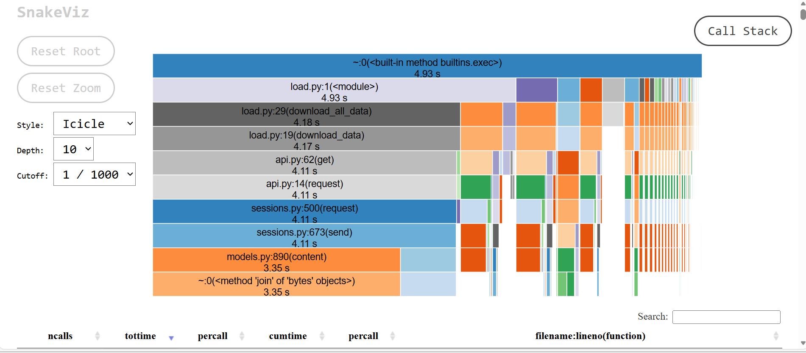

# Sección 2.2.1 – Visualización del Perfil con SnakeViz

Para analizar el rendimiento del script `load.py`, se utilizó la herramienta **SnakeViz** para visualizar los resultados del perfilado generado con `cProfile`, almacenados en el archivo `profile_io.prof`.

La visualización tipo *Icicle* permitió identificar de manera clara las funciones que consumen la mayor parte del tiempo de ejecución. Los bloques de mayor tamaño corresponden a las funciones:

- `download_all_data` y `download_data` en `load.py`
- `get` y `request` en `api.py`
- `request` y `send` en `sessions.py`

Estas funciones pertenecen a la librería **requests**, la cual se encarga de realizar solicitudes HTTP. El hecho de que estas funciones dominen el gráfico indica que la mayor parte del tiempo de ejecución se dedica a operaciones de red para la descarga de datos externos.

Por lo tanto, el principal cuello de botella del programa se encuentra en la latencia de entrada/salida (I/O) asociada a las solicitudes HTTP, y no en cálculos internos del script. SnakeViz permitió identificar este comportamiento de forma visual e intuitiva, facilitando la localización de las funciones más costosas en términos de tiempo de ejecución.

## Evidencia

A continuación se muestra la captura de pantalla de la visualización generada por SnakeViz, donde se resaltan las funciones que consumen más tiempo de ejecución.

